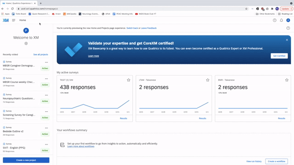

```{r, include = FALSE}
knitr::opts_chunk$set(
  collapse = TRUE,
  comment = "#>"
)
```

```{r setup}
library(RankinLabTools)
```


# Overview

The Rankin lab, and many other teams at the Memory and Aging Center + UCSF at large, leverage the Qualtrics platform as a quick-and-easy way to create electronic questionnaires, tests, and other types of data being collected. Qualtrics offers an API to easily collect data from these surveys, and there is an existing R package called `{qualtRics}` purpose-built for querying the API. 

This vignette describes how to use wrapper functions I wrote around the `{qualtRics}` package to query our data from the UCSF instance of Qualtrics.

While Qualtrics does allow for manual downloading of data into CSV, TSV, and there file types, the ultimate goal of using the API query approach is to enable complete automation of data retrieval and cleaning. For example, a script written to download, score, clean, and write data (e.g. to a CSV, SQL server, etc.) will better ensure data integrity while freeing up research teams to focus more on data collection and analysis rather than pesky data management issues.

## Connecting to Qualtrics

### Step 0: Pre-Authentication

I am going to assume minor familiarity with APIs (application programming interfaces) for this vignette. If you have no idea what they are or how they work, please at least take a look at the [Wikipedia page](https://en.wikipedia.org/wiki/API) and spend a few minutes browsing the web for searches about APIs.

Now that you understand APIs, you'll know that many require some sort of authentication or password to access the data, and Qualtrics is no exception to that. To query the Qualtrics API, you will need to obtain your API Token from the Qualtrics site. See the GIF below for a 15 second summary to complete this:



In words, perform the following steps:

1. Open Qualtrics via MyAccess.ucsf.edu (or through your SSO provider if not at UCSF)
1. Select the Settings button in the top right corner of the page followed by Account Settings.
1. Press the Qualtrics ID tab.
1. Find the "Token" variable listed under the "API" block, and copy that value.

### Step 1: Authentication

Now that you have your authentication token available, you'll be able to use it to tell the Qualtrics API who you are. This is done over an HTTP request, and fortunately someone else created the `{qualtRics}` package to do all of the heavy-lifting of talking to Qualtrics and creating easily-readable data frames. But first, authentication:

1. Download the `{qualtRics}` package with 'install.packages("qualtRics")` if it is not already available.
2. Run the `qualtrics_ucsf_api_credentials(api_key = "YOUR_KEY")` function, and substitute in the API token you copied in Step 0 into YOUR_KEY.
    * To avoid leaving your API key in plain-text, I recommend storing the token in your OSx Keychain (Mac), and using the `keyringr` package to retrieve the key when running a session. For example: `qualtrics_ucsf_api_credentials(api_key = keyringr::decrypt_kc_pw("QUALTRICS_TOKEN"))` will require computer admin privileges to look in the Keychain for QUALTRICS_TOKEN, and will return the appropriate value if it exists.
3. Your session is now authenticated, and Qualtrics will let you download data for the next 60 minutes without needing to reauthenticate. (Note: this could change in the future, so Google for "qualtrics api authentication duration" or similar if time-outs occur before 60 minutes.)

Optional: to further elaborate on this authentication process and the `{qualtRics}` package: the function mentioned in bullet point 2 is a wrapper around `qualtRics::qualtrics_api_credentials()` where I've simply inserted UCSF's base URL for the Qualtrics API ("ucsf.co1.qualtrics.com"). All other arguments have been left alone.

### Step 2: Downloading Survey Data

Now that you're authenticating, finally on to the good stuff!

While this isn't strictly necessary, I recommend getting a quick overview of the surveys available in your current:

```
qualtRics::all_surveys() %>% View()

# or view just a sampling of results with

qualtRics::all_surveys() %>% head() %>% View()

```

Roughly the same information is available in the Account Settings noted earlier in Step 0 of the directions; in the GIF, the tall black box on the left-hand side of the screen covers values for Survey Name and Survey ID. Regardless of how you gather this information, you presumably have particular surveys from which to download data, and you will need the Survey IDs for those surveys. Run the following code to pull data from one survey.

```
qualtRics::fetch_survey("YOUR_SURVEY_ID", force_request = T, label = F, convert = F) %>% 
  View()

# this set up, using the label=F and convert=F arguments, is equivalent to exporting from Qualtrics as numeric. Remove `label` and `convert` arguments (or change both to TRUE) to be equivalent to Choice Text output
```

If you want to get fancy and `map()` this process over all of your **active** surveys, I would recommend the following as a starter:

```
# Create a vector of all the active surveys. Well actually, use head() to cut this down to only 6 surveys because much more is really just gratuitous for demonstration purposes, and isn't kind to the Qualtrics API

tests <- qualtRics::all_surveys() %>% 
  dplyr::filter(isActive == "TRUE") %>% # can't query inactive surveys it seems
  head()

# Using this vector of SurveyIDs, map over the fetch_survey() function and label each of the elements in the list according to their survey name with setNames()
data <- tests %>%
  pull(id) %>%
  map(~ qualtRics::fetch_survey(., force_request = T, label = F, convert = F)) %>%
  setNames(pull(tests,name))
  
```


## Cleaning Qualtrics Data


